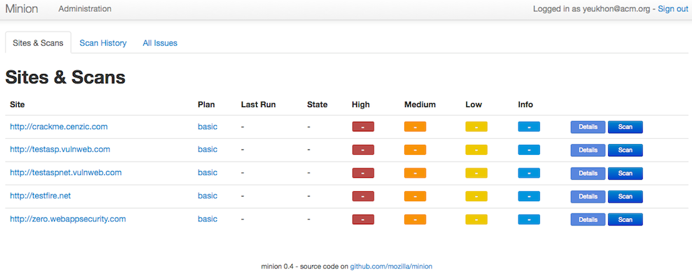
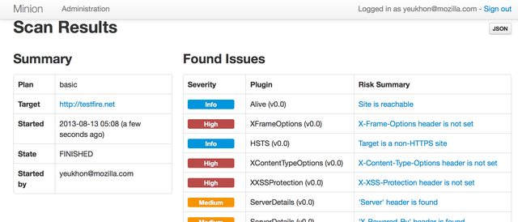
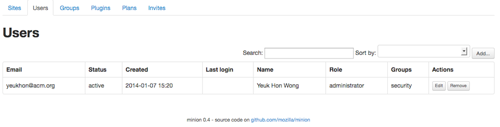
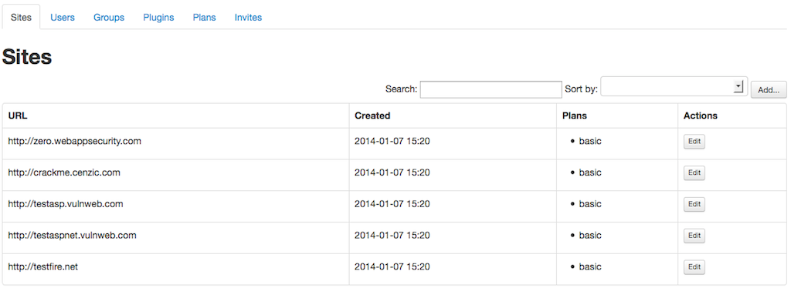
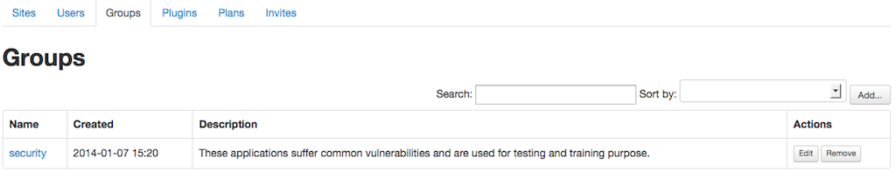
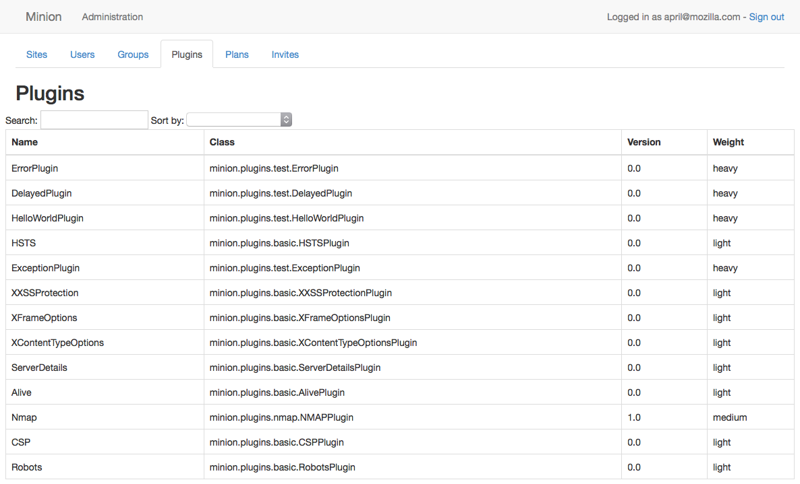

Using Minion
############

Minion's frontend is separate from the backend repository. Here we show how the frontend looks.

Login
=====

Minion's frontend is authenticated using Persona. You can replace Persona if you want. The backend is authentication
agonistic; it is the job of the frontend web service to verify that given user has permission to access a resource.
We explain this in :doc:`inside_minion`. 

.. image:: images/login.png

If you are new to Persona, please check :doc:`persona` to find out how to make your email address into a Persona-capable
email address.

Dashboard
=========

The screenshot belows is the first thing a Minion user will see after logging in. The current logged in user
can only see the sites that he or she has access to; the user must be in a group that the site is also in. We
will explain this later in the admin section.

The dashboard shows the progress of the newest scan (if any), the number of issues discovered by the newest scan, a link
to view the detail of the newest scan and a button to trigger a scan.

The **Scan History** tab shows all the scans performed on the site. The **All Issues** tab lists issues of the newest scan for
each site the user has access to.

If the user is in multiple groups, the dashboard also provide a drop-down menu on the upper mid-right corner to switch
the group view, as shown in the screenshot below. In this case this current logged in user belongs to two groups.

.. image:: images/dashboard-groups.png

Scan Detail
===========

The scan detail page lists all the issues with a short title. If the scan failed it will list the reason.

Issue Detail
============

Every issue has a detail page that describes the problem, possible mitigation and a list of references to look up.

.. image:: images/scan-issue.png
 

Admin: Users
============

This panel lists all the users in Minion. As with all other panels in the rest of the administration dashboard,
there is a filter and an in-page search box to find users.

Admin: Sites
============

This panel lists all the sites that have been added to this Minion instance. Currently only admin users can
add sites and site url format is also restricted. As of 0.4 release, Minion can only accept url that looks like
``http[s]://<subdomain>*.<domain>``. For example, while ``192.168.1.100``, ``foobar.com`` and ``foo.bar.com``
are valid, the frontend will not accept paths so that ``foobar.com/project/`` is not acceptable.

There is a `longstanding ticket <https://github.com/mozilla/minion-frontend/issues/100>`_ to loosen up this restriction in the future release of Minion.

.. note:: 
    
    Also, since 0.4 release there is a hostname blacklist and whitelist mechanism added to Minion. Hostnames like 127.0.0.1 are blocked by Minion by default. To whitelist and/or blacklist what hostnames can be scanned, please refer to :ref:`whitelist_blacklist_hostname_label`.
 

Every site can have one or more attack plan. An attack plan is a JSON configuration which specifies the type of
plugin the attack will use. Every site belongs to zero or more groups and only the users in those groups can
scan the site. As of 0.4 release, you must add the site first and then add the site and user to a group in the **Group**
tab.

Admin: Groups
=============

As aforementioned in the previous section, once a site has been added, it should be added to a group by going to
the **Groups** panel. Every group contains a set of users and a set of sites; only these users can access these sites.
Bob's personal blog can belong to two groups named Group A and Group B. As long as Alice is in one of these two groups, 
she can too scan Bob's personal blog on Minion.

By pressing the **Edit** button, the user is redirected to an editor page.

.. image:: images/admin-groups-editor.png

Admin: Plugins
==============

A Minion plugin is basically a Python class that invoke a security scan tool. This scan tool can be as simple as
a few lines of Python code directly in the class or invoking an external exectuable binary (which can be a simple bash
script or as complex as OWASP ZAP).

Minion's backend actually ships with some simple Python plugins called **basic** plugin. In the screenshot above,
they are under the namespace **minion.plugins.basic**. These plugins check HTTP header and robots.txt. Other plugins are
not distributed with the backend. You must install them indivdually (although the backend repository has the sample
configuration file for zap, skipfish and nmap).

To learn more about how to install plugins, please check :doc:`install_plugins`. For plugin development,
please refer to :doc:`developing_plugins`.

Admin: Plans
============

Plans are basically JSON blob/document that specifies what plugins to use (and their configurations). You can
have a plan that utilizes the **basic** plugin and ZAP plugin. 

.. image:: images/admin-plans.png

Admin: Invites
==============

If you want to invite another person to use your Minion, you can send them an invitation. You can add, resend, or cancel
invitation. You can also check whether the invitation is accepted, declined or expired.

When a user is invited, the account is created, but the account is suspended until the user
has accepted the invitation and is authenticated by logging in using a Persona address. If your friend
has two email addresses and you invite your friend by using the non-Persona email address,
your friend can accept the invitation and log in using his or her Persona email address. Minion will take
care of the transition (replacing non-Persona email address in the database which his or her Persona account).

